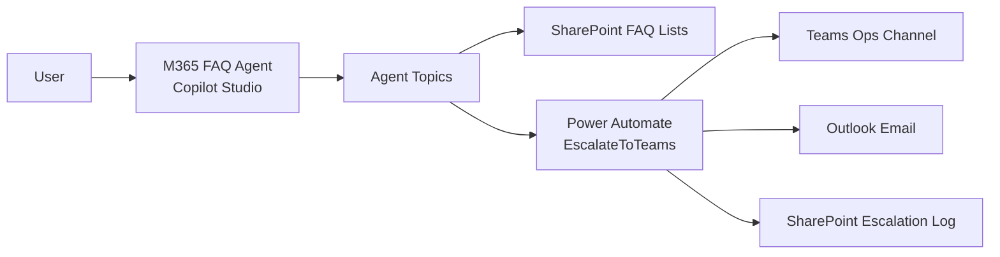
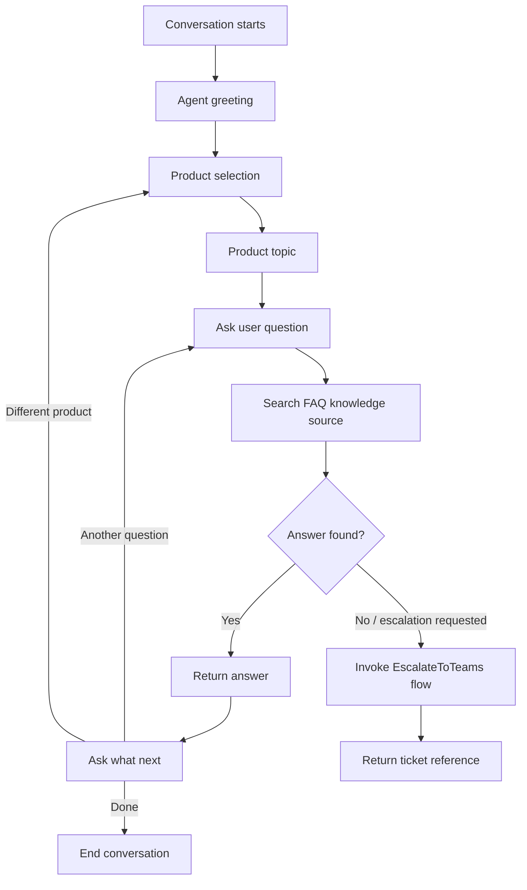
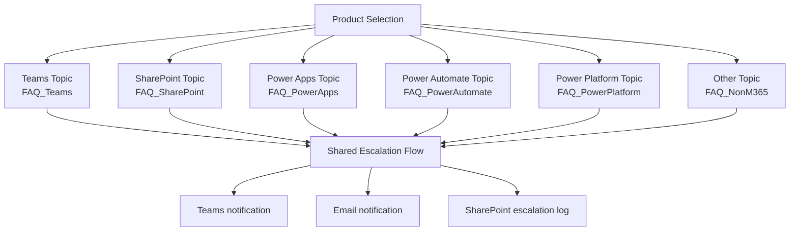
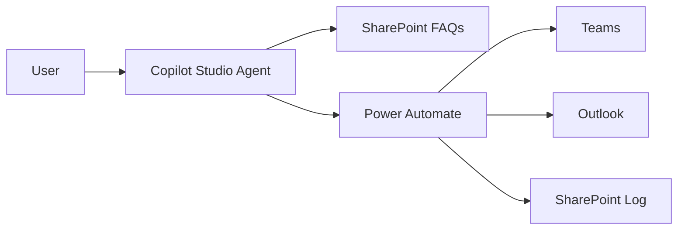

# M365 FAQ Agent - Full Solution Analysis, Licensing, Design, and Presentation Content

## 1. Document Purpose

This document provides a full analysis of the `M365FAQAgent` solution package. It covers what the solution does, how it is designed, which Microsoft services it uses, what licenses are required for developers and users, and presentation slide content for students and beginners.

The presentation section does not create a PowerPoint file. It provides slide-by-slide content and speaker notes only.

Licensing guidance in this document is based on the solution source files and Microsoft Learn licensing pages checked on 2026-05-10. Microsoft licensing can change, so the official Microsoft licensing guide should be treated as the final source before purchase or production deployment.

## 2. Source Package Analyzed

Source package:

`M365FAQAgent_1_0_0_1.zip`

Extracted solution contents reviewed:

| Source area | Files reviewed | What was checked |
|---|---|---|
| Solution manifest | `solution.xml` | Solution name, version, publisher, root components. |
| Customizations | `customizations.xml` | Flow registration and connection references. |
| Bot metadata | `bots/cra93_M365FAQAgent/bot.xml` | Agent name, authentication mode, publish details, template. |
| Bot configuration | `bots/cra93_M365FAQAgent/configuration.json` | Generative actions, AI settings, recognizer. |
| GPT component | `botcomponents/cra93_M365FAQAgent.gpt.default/*` | Agent instructions, scope, tone, knowledge behavior. |
| Topics | `botcomponents/*topic*/data` | Conversation flow, questions, routing, fallback, escalation. |
| Knowledge sources | `botcomponents/*FAQ*/data` | Knowledge source type and skill configuration links. |
| Dataverse table search | `dvtablesearchs/*/dvtablesearch.xml` | SharePoint FAQ list mappings. |
| Search entities | `dvtablesearchentities/*/dvtablesearchentity.xml` | FAQ list entity names. |
| Power Automate workflow | `Workflows/EscalateToTeams-*.json` | Trigger schema, Teams action, email actions, SharePoint logging, response output. |
| Asset mappings | `Assets/*.xml` | Bot-to-flow and bot-to-search set relationships. |

## 3. Executive Summary

M365 FAQ Agent is a Copilot Studio solution that uses Microsoft 365 services to provide an effective FAQ support agent. It helps users ask questions about Microsoft 365 products, searches curated SharePoint FAQ content, and escalates unanswered questions to an IT operations team.

The solution demonstrates a practical low-code support pattern:

- Copilot Studio provides the conversational agent.
- SharePoint stores the FAQ knowledge sources.
- Power Automate handles escalation.
- Microsoft Teams alerts the support team.
- Outlook sends email notifications.
- SharePoint stores the escalation log.

For students and beginners, this is a good learning solution because it shows how Microsoft 365 and Power Platform services work together in a real support scenario.

## 4. Solution Identity

| Item | Value from source |
|---|---|
| Solution unique name | `M365FAQAgent` |
| Version | `1.0.0.1` |
| Package type | Unmanaged Power Platform solution |
| Publisher unique name | `Vishnuprasad` |
| Publisher display name | `Vishnu` |
| Publisher email | `info@wrvishnu.com` |
| Publisher website | `https://www.wrvishnu.com` |
| Customization prefix | `wr` |
| Main agent name | `M365 FAQ Agent` |
| Main workflow | `EscalateToTeams` |
| Workflow ID | `1bcd942d-a94b-f111-bec5-70a8a59be063` |
| Language | English, language code `1033` |
| Last published UTC | `2026-05-09T15:25:39.1694934` |
| Last publish status | Succeeded |

## 5. What the Solution Does

The agent is designed to:

1. Welcome the user.
2. Ask which product the user needs help with.
3. Let the user choose from Microsoft Teams, SharePoint, Power Apps, Power Automate, Power Platform, or Other.
4. Ask the user for their question.
5. Search the relevant FAQ knowledge source.
6. Return an answer from the curated FAQ content.
7. Offer next actions.
8. Escalate unresolved questions to IT operations.
9. Notify the IT team through Teams and email.
10. Send a confirmation email.
11. Log escalation details in SharePoint.

## 6. Business Problem

Support teams often receive repeated Microsoft 365 questions. Users may not know where the correct help article or internal FAQ is stored. This causes delays for users and repeated work for IT teams.

This solution helps by giving users a guided FAQ agent and giving support teams a clear escalation path when the FAQ content does not answer the question.

## 7. Services Used

| Service | Usage in this solution |
|---|---|
| Copilot Studio | Builds and hosts the conversational agent. |
| Microsoft Dataverse solution packaging | Stores and transports the solution components. |
| SharePoint Online | Stores FAQ knowledge lists and escalation logs. |
| Power Automate | Runs the escalation workflow. |
| Microsoft Teams | Receives escalation adaptive cards in an ops channel. |
| Office 365 Outlook | Sends email alerts and confirmations. |
| Microsoft Entra ID | Provides user identity and email context. |

## 8. High-Level Architecture

## 9. Agent Configuration Analysis

The bot configuration shows:

| Setting | Value |
|---|---|
| Generative actions | Enabled |
| Agent connectable | Enabled |
| Default GPT component | `cra93_M365FAQAgent.gpt.default` |
| Model knowledge | Enabled |
| File analysis | Enabled |
| Semantic search | Enabled |
| Content moderation | Low |
| Latest model opt-in | False |
| Recognizer | Generative AI recognizer |

The GPT component instructions define the agent as an IT support assistant that helps employees with Microsoft 365 questions. It is instructed to search curated FAQ content, provide complete answers, and escalate when it cannot answer confidently.

Web browsing is disabled in the GPT component. This means the solution is designed to rely on internal knowledge sources rather than open web search.

## 10. Topic Analysis

| Topic | Trigger type | Purpose |
|---|---|---|
| Conversation Start | `OnConversationStart` | Starts the chat and asks the user to select a product. |
| Greeting | `OnRecognizedIntent` | Handles greetings and routes to product selection. |
| Teams Questions | `OnRecognizedIntent` | Handles Microsoft Teams questions and supports escalation. |
| Sharepoint Topic | `OnRecognizedIntent` | Handles SharePoint questions. |
| Search / Conversational boosting | `OnUnknownIntent` | Searches and summarizes content from knowledge sources. |
| Fallback | `OnUnknownIntent` | Handles unmatched messages and redirects to escalation after repeated fallback. |
| Escalate | `OnEscalate` | Handles human handoff-style requests. |
| Multiple Topics Matched | `OnSelectIntent` | Asks the user to clarify when several topics match. |
| Thank You | `OnRecognizedIntent` | Responds to gratitude. |
| Goodbye | `OnRecognizedIntent` | Handles goodbye messages. |
| Start Over | `OnRecognizedIntent` | Restarts the conversation after confirmation. |
| End of Conversation | `OnSystemRedirect` | Collects feedback and closes conversation. |
| Reset Conversation | `OnSystemRedirect` | Clears variables and cancels active dialogs. |
| Sign in | `OnSignIn` | Handles sign-in flow when required. |
| On Error | `OnError` | Handles errors and logs telemetry. |

## 11. Conversation Flow Design

## 12. Knowledge Source Analysis

The solution includes six SharePoint-based knowledge source configurations.

| FAQ knowledge source | SharePoint list URL |
|---|---|
| FAQ_Teams | `https://vishtechtalk.sharepoint.com/sites/DemoSite/Lists/FAQ_Teams` |
| FAQ_SharePoint | `https://vishtechtalk.sharepoint.com/sites/DemoSite/Lists/FAQ_SharePoint` |
| FAQ_PowerApps | `https://vishtechtalk.sharepoint.com/sites/DemoSite/Lists/FAQ_PowerApps` |
| FAQ_PowerAutomate | `https://vishtechtalk.sharepoint.com/sites/DemoSite/Lists/FAQ_PowerAutomate` |
| FAQ_PowerPlatform | `https://vishtechtalk.sharepoint.com/sites/DemoSite/Lists/FAQ_PowerPlatform` |
| FAQ_NonM365 | `https://vishtechtalk.sharepoint.com/sites/DemoSite/Lists/FAQ_NonM365` |

All six knowledge sources are configured as federated structured search sources using SharePoint list data.

## 13. Product-Specific Behavior

### Microsoft Teams

The Teams topic is the most complete product-specific topic in the solution.

It:

- Asks: `What's your question about Microsoft Teams?`
- Stores the question in `Topic.VarUserQuestion`.
- Searches the `FAQ_Teams` knowledge source.
- Allows the user to ask another Teams question.
- Allows the user to select a different product.
- Allows the user to escalate to the IT team.
- Ends the conversation when the user is done.
- Invokes `EscalateToTeams` for automatic and manual escalation paths.

### SharePoint

The SharePoint topic:

- Asks: `What's your question about SharePoint?`
- Stores the question in `Topic.VarUserQuestion`.
- Searches the `FAQ_SharePoint` knowledge source.
- Allows another SharePoint question.
- Allows changing product.
- Allows ending the conversation.

### Other Product Areas

The package includes knowledge sources for Power Apps, Power Automate, Power Platform, and Non-M365 content. The routing currently reuses the Teams topic for several choices in the exported topic definitions, so the recommended design is to create separate product topics for each FAQ source.

## 14. Escalation Flow Analysis

The flow `EscalateToTeams` is triggered by the agent as a skill/action.

### Trigger Inputs

| Input title | Internal field | Meaning |
|---|---|---|
| userQuestion | `text` | User's question. |
| userEmail | `text_1` | User's email address. |
| product | `text_2` | Product selected by the user. |
| conversationId | `text_3` | Copilot conversation ID. |

### Flow Steps

| Step | Action type | Purpose |
|---|---|---|
| `InitticketRef` | Initialize variable | Creates a ticket reference using `OPS-yyyyMMddHHmm`. |
| `Teams-PostEscalationCard` | Microsoft Teams connector | Posts an adaptive card to a Teams channel. |
| `Email-NotifyOpsTeam` | Office 365 Outlook connector | Sends an escalation alert email. |
| `Email-ConfirmToUser` | Office 365 Outlook connector | Sends user confirmation email. |
| `SharePoint-LogEscalation` | SharePoint connector | Creates an escalation log item. |
| `Response-ReturnTicket` | Response | Returns ticket reference and status to the agent. |

### Escalation Outputs

| Output | Meaning |
|---|---|
| `ticketref` | Generated tracking number. |
| `text` | Status text, returned as `escalated`. |

## 15. Escalation Data Design

The SharePoint escalation log receives:

| Field | Source value |
|---|---|
| Title | User question |
| QueryDate | Current UTC time |
| Product | Selected product |
| ResolutionStatus | `escalated` |
| EscalationTicketRef | Generated ticket reference |
| UserId | User email |
| StaleContentFlagged | `false` |

The Teams adaptive card includes:

- Ticket reference.
- User email.
- Product.
- Original question.
- A `Claim and Respond` submit action.

## 16. Connection Reference Analysis

The solution uses these connector types:

| Connector | Connection reference examples | Used for | Connector class |
|---|---|---|---|
| SharePoint Online | `cra93_M365FAQAgent.cr.*`, `wr_sharedsharepointonline_*` | FAQ search and escalation logging | Standard |
| Office 365 Outlook | `wr_sharedoffice365_fe6ad` | Email notifications | Standard |
| Microsoft Teams | `wr_sharedteams_1df4d` | Teams adaptive card | Standard |

The Microsoft connector documentation lists Microsoft Teams, Office 365 Outlook, and SharePoint as standard connectors for Power Automate.

## 17. Licensing Requirements

### 17.1 Important Licensing Assumptions

This licensing section is based on the actual solution features:

- Copilot Studio agent.
- Generative answers and semantic search.
- SharePoint knowledge sources.
- Power Automate cloud flow.
- Standard connectors only: Teams, Office 365 Outlook, SharePoint.
- Microsoft Teams channel as a likely consumption channel.
- Microsoft 365 user identity through `System.User.Email`.

The package does not show premium connectors, custom connectors, AI Builder actions, Dataverse custom tables, RPA, on-premises gateway, or Power Pages.

### 17.2 License Required for Agent Developers / Makers

| Role | Required license or entitlement | Why it is needed |
|---|---|---|
| Agent developer / maker | Copilot Studio User License assigned to the maker, plus tenant Copilot Studio capacity/license, or another Microsoft-supported authoring route such as Microsoft 365 Copilot license, Copilot Studio authors role, or trial for testing | Required to create and manage Copilot Studio agents. |
| Tenant / Power Platform admin | Copilot Studio tenant license or configured Copilot Studio pay-as-you-go / Copilot Credit capacity | Required so the organization can run and meter Copilot Studio usage. |
| Flow developer / owner | Microsoft 365 seeded Power Automate rights are normally enough for this flow because it uses standard connectors; Power Automate Premium or Process is needed if premium connectors, high-volume enterprise flow licensing, service-principal ownership, or premium features are added | Required to create, own, and run the Power Automate cloud flow. |
| SharePoint FAQ maintainer | Microsoft 365 license with SharePoint access | Required to create and maintain FAQ lists and escalation log list. |
| Teams ops owner | Microsoft 365 / Teams entitlement | Required to own or manage the Teams channel where escalation cards are posted. |
| Outlook mailbox sender account | Microsoft 365 / Exchange Online mailbox entitlement | Required for the connection account that sends notification emails. |

Recommended developer licensing for this exact solution:

| Scenario | Recommended licensing |
|---|---|
| Learning or demo only | Copilot Studio trial can be used to create and test in the test chat, but Microsoft Learn states trial users cannot publish the agent. |
| Build and publish in a tenant | Copilot Studio tenant capacity/license plus Copilot Studio User License for each maker who builds/manages the agent. |
| Use Microsoft 365 Copilot-centered agent experience | Microsoft 365 Copilot license can provide authoring access for extending Microsoft 365 Copilot with agents, depending on the organization setup. |
| Standard connector escalation flow | Microsoft 365 license with seeded Power Automate rights is typically enough because Teams, Outlook, and SharePoint are standard connectors. |
| Production flow with higher scale or premium additions | Power Automate Premium for user-owned premium automation, or Power Automate Process for flow-owned enterprise automation. |

### 17.3 License Required for End Users / Consumers

Microsoft Learn states that users of a published Copilot Studio agent do not need a special Copilot Studio license. Anyone who can access the published agent can interact with it.

For this solution, end users still need practical access rights:

| End-user need | Required entitlement |
|---|---|
| Open the agent in Teams or another Microsoft 365 channel | A Microsoft 365 account with access to that channel. |
| Use Microsoft Teams channel/app experience | Teams entitlement, depending on tenant licensing and regional packaging. |
| Receive confirmation email | A valid email address; Exchange Online mailbox if internal email delivery is expected. |
| Access content grounded in SharePoint FAQ lists | The agent/connection must be permitted to access the FAQ source; user access behavior depends on how the agent and knowledge source are configured. |
| Use the agent without a Copilot Studio maker role | No Copilot Studio maker/user license required for consumption. |

Recommended end-user licensing for this exact solution:

| User type | Recommended license position |
|---|---|
| Internal employee or student consuming the Teams agent | Microsoft 365 license that includes the required channel access, such as Teams and email, plus permission to access the published agent. No separate Copilot Studio maker license is needed. |
| User with Microsoft 365 Copilot license | When using agents in Microsoft 365 Copilot, Teams, or SharePoint for classic answers, generative answers, or Microsoft Graph tenant grounding, Microsoft Learn says that usage is zero-rated against the Copilot Studio message pack/meter. Actions and other advanced capabilities should still be reviewed against current Copilot Studio billing rules. |
| External/guest user | Must be validated carefully. Microsoft Learn notes that guest users of your tenant cannot access Copilot Studio authoring; consuming a published channel experience depends on channel support, identity, sharing, and tenant policy. |

### 17.4 Copilot Studio Capacity / Billing

Copilot Studio now uses Copilot Credits as the common currency across Copilot Studio capabilities. Microsoft Learn states that Copilot Credits can be obtained through:

- Pay-as-you-go meters.
- Prepurchase plans.
- Copilot Credit prepaid pack subscriptions.

The agent can consume Copilot Credits when it retrieves information, responds to prompts, uses actions, or uses custom skills. Because this solution uses generative answers and invokes a Power Automate action, capacity planning should include both conversation volume and escalation volume.

### 17.5 Power Automate Licensing for This Flow

The flow uses standard connectors:

- Microsoft Teams.
- Office 365 Outlook.
- SharePoint.

Microsoft Learn states that Microsoft 365 seeded Power Automate licenses include standard connectors. Therefore, for this exact flow design, a Microsoft 365 license with Power Automate seeded rights is generally enough.

Power Automate Premium or Process licensing should be considered if:

- Premium connectors are added.
- The flow is changed to use custom connectors.
- The flow runs under a service principal.
- The flow becomes a high-volume enterprise process.
- The organization wants the automation licensed independently from individual users.
- The environment is a Managed Environment with premium licensing requirements.

### 17.6 License Summary

| Person / function | Minimum likely requirement for this solution | Notes |
|---|---|---|
| Agent maker | Copilot Studio User License or supported authoring entitlement | Needed to create/manage the agent. |
| Organization | Copilot Studio tenant capacity/license or pay-as-you-go/Copilot Credits | Needed for published agent usage and billing. |
| Flow owner | Microsoft 365 license with Power Automate standard connector rights | Enough for current standard connectors in many Microsoft 365 tenants. |
| Flow owner with premium changes | Power Automate Premium or Process | Needed if premium/custom connectors or independent process licensing are introduced. |
| FAQ/content owner | Microsoft 365 SharePoint access | Needed to maintain FAQ lists. |
| Ops responder | Microsoft Teams and Outlook access | Needed to receive Teams cards and emails. |
| End user | Access to published agent channel; no special Copilot Studio license | Must have normal Microsoft 365 access needed for Teams/email/channel. |

## 18. Security and Permission Design

Security is controlled by Microsoft Entra ID, Copilot Studio sharing, SharePoint permissions, Teams permissions, and connector connections.

Recommended controls:

- Restrict who can edit the agent.
- Restrict who can edit the Power Automate flow.
- Use a service/support mailbox for production email sending.
- Use a dedicated Teams ops channel for escalations.
- Restrict the SharePoint escalation log to support/admin users.
- Review FAQ list permissions to prevent exposing internal content.
- Avoid hardcoded personal email addresses in production flows.
- Review whether the agent should answer only from approved FAQ lists.

## 19. Implementation Observations

The source package shows a strong working foundation. The following observations are based on actual exported files:

| Area | Observation | Recommended production action |
|---|---|---|
| Teams topic | Complete FAQ and escalation pattern exists. | Use this as the pattern for other product topics. |
| SharePoint topic | Searches SharePoint FAQ and supports next actions. | Add the same escalation path used by Teams. |
| Product routing | Some product choices route to Teams topic in the export. | Route each product to its matching topic. |
| Additional FAQ sources | Power Apps, Power Automate, Power Platform, and Non-M365 sources exist. | Add dedicated topics for each source. |
| Ticket reference | Uses minute-level timestamp. | Add seconds or a GUID fragment to avoid duplicates. |
| Email recipient | Flow contains fixed email values. | Use dynamic user email for user confirmation and a support mailbox for ops. |
| Prompt text | Some labels contain spelling issues such as `avilable` and `VarProdtuctSelected`. | Clean labels and variable names before production. |

## 20. Recommended Final Solution Design

## 21. Deployment Checklist

- Import solution into the target environment.
- Rebind connection references for SharePoint, Teams, and Outlook.
- Confirm SharePoint FAQ lists exist.
- Confirm escalation log list exists.
- Confirm Teams team and channel IDs are updated.
- Replace test/personal email addresses.
- Assign Copilot Studio maker licenses or authoring access to developers.
- Configure tenant Copilot Studio capacity or billing.
- Confirm flow owner licensing.
- Confirm user/channel access.
- Test each FAQ source.
- Test Teams escalation.
- Test email notification.
- Test SharePoint logging.
- Publish the agent.
- Share the agent with the intended users.

## 22. Testing Scenarios

| Scenario | Expected result |
|---|---|
| Start chat | Agent greets user and shows product choices. |
| Select Microsoft Teams | Agent asks for Teams question. |
| Ask known Teams FAQ | Agent returns answer from `FAQ_Teams`. |
| Ask unknown Teams FAQ | Agent escalates and returns ticket reference. |
| Select SharePoint from greeting | Agent routes to SharePoint topic. |
| Ask SharePoint FAQ | Agent searches `FAQ_SharePoint`. |
| Choose different product | Agent returns to product selection. |
| Say thank you | Agent sends thank-you response. |
| Say goodbye | Agent handles end-of-conversation flow. |
| Flow runs | Teams card, email, SharePoint log, and ticket response are created. |

## 23. Presentation Slide Content

### Slide 1 - Title

**Building an Effective M365 FAQ Agent with Copilot Studio and Microsoft 365**

Subtitle:

Using Copilot Studio, SharePoint, Power Automate, Teams, and Outlook to support Microsoft 365 FAQ questions.

Slide notes:

This session explains a real Power Platform solution called M365 FAQ Agent. The goal is to show how Copilot Studio and Microsoft 365 services can be combined to build a useful support agent without custom code.

### Slide 2 - Support Problem

**Repeated questions slow down support**

- Users ask similar Microsoft 365 questions.
- Support teams repeat the same answers.
- FAQ content is often stored in different places.
- Some questions still need human help.

Slide notes:

Many organizations already have FAQ content, but users may not know where to find it. This agent gives users one guided place to ask questions and gives the support team a clear path for unresolved questions.

### Slide 3 - Solution Idea

**A guided FAQ support agent**

- User selects a product.
- Agent asks for the question.
- Agent searches the matching FAQ source.
- Agent answers from trusted SharePoint content.
- Agent escalates when it cannot answer.

Slide notes:

The agent is designed to avoid guessing. It searches curated FAQ content and uses escalation when the answer is not available or not confident.

### Slide 4 - Microsoft Services Used

**Services working together**

- Copilot Studio for the chat agent.
- SharePoint for FAQ knowledge.
- Power Automate for escalation.
- Microsoft Teams for support team alerts.
- Outlook for email notifications.

Slide notes:

Each service has a clear role. Copilot Studio handles the conversation, SharePoint stores the knowledge, and Power Automate connects the agent to Teams, Outlook, and SharePoint logging.

### Slide 5 - User Experience

**How a user gets help**

1. Start the chat.
2. Select a product.
3. Ask a question.
4. Read the answer.
5. Ask another question or escalate.

Slide notes:

The experience is simple for beginners. The user does not need to know which SharePoint list stores the answer. The agent guides them through the process.

### Slide 6 - Knowledge Source Design

**FAQ lists by product**

- FAQ_Teams.
- FAQ_SharePoint.
- FAQ_PowerApps.
- FAQ_PowerAutomate.
- FAQ_PowerPlatform.
- FAQ_NonM365.

Slide notes:

The solution separates FAQ content by product. This makes it easier for support teams to maintain accurate answers and easier for the agent to search the correct source.

### Slide 7 - Teams Question Flow

**Example: Microsoft Teams**

- Agent asks for the Teams question.
- Searches the Teams FAQ list.
- Provides an answer if available.
- Offers next actions.
- Can escalate to IT operations.

Slide notes:

The Teams topic is the most complete topic in the current solution. It includes both FAQ search and escalation, so it is a good template for the other product topics.

### Slide 8 - Escalation Flow

**When the agent cannot answer**

- Creates a ticket reference.
- Posts an adaptive card to Teams.
- Sends an email to operations.
- Sends confirmation to the user.
- Logs the request in SharePoint.

Slide notes:

Escalation is important because the user should not be left without a next step. The flow gives the user a tracking number and alerts the support team.

### Slide 9 - Solution Design

**End-to-end design**

Slide notes:

This design shows the main pattern. The user only sees the agent, but behind the scenes the agent can search knowledge, trigger automation, notify support, and save a record.

### Slide 10 - Licensing Overview

**Who needs what**

- Makers need Copilot Studio authoring access.
- The organization needs Copilot Studio capacity or billing.
- The flow owner needs Power Automate rights.
- End users do not need a special Copilot Studio maker license.
- End users need access to the published channel, such as Teams.

Slide notes:

The key point is the difference between builders and consumers. Builders need Copilot Studio access. Consumers need permission to access the published agent, but they do not need to be licensed as Copilot Studio makers.

### Slide 11 - Benefits

**Why this solution helps**

- Faster answers for common questions.
- Less repeated work for IT teams.
- Consistent answers from curated content.
- Clear escalation for unanswered questions.
- Useful learning project for Power Platform beginners.

Slide notes:

The value is both operational and educational. It improves support and also teaches how Microsoft 365 services can be connected in a practical solution.

### Slide 12 - Recommended Next Build

**Make every product path complete**

- Create one topic per FAQ product.
- Reuse the Teams escalation pattern.
- Clean up routing and labels.
- Use production support mailbox values.
- Monitor FAQ gaps from escalation logs.

Slide notes:

The next improvement is to make the design consistent across all product categories. Once every product has its own topic and shared escalation path, the agent becomes easier to maintain and scale.

### Slide 13 - Demo Script

**Suggested demo**

1. Start the agent.
2. Select Microsoft Teams.
3. Ask a known FAQ question.
4. Show the answer.
5. Ask an unknown question.
6. Show the escalation ticket.
7. Show Teams card, email, and SharePoint log.

Slide notes:

This demo shows both sides of the solution: self-service answers and human escalation. It helps beginners understand the complete process.

### Slide 14 - Key Takeaway

**Copilot Studio + Microsoft 365 can create practical support agents**

- Copilot Studio handles conversation.
- SharePoint provides trusted knowledge.
- Power Automate runs business processes.
- Teams and Outlook notify people.
- SharePoint logs the result.

Slide notes:

The most important takeaway is that this is an end-to-end business solution. It is not only a chatbot. It connects conversation, knowledge, automation, notification, and tracking.

## 24. References

- Microsoft Learn, Copilot Studio licensing: https://learn.microsoft.com/en-us/microsoft-copilot-studio/billing-licensing
- Microsoft Learn, Assign licenses and manage access to Copilot Studio: https://learn.microsoft.com/en-us/microsoft-copilot-studio/requirements-licensing
- Microsoft Learn, Power Automate licensing FAQ: https://learn.microsoft.com/en-us/power-platform/admin/power-automate-licensing/faqs
- Microsoft Learn, Types of Power Automate licenses: https://learn.microsoft.com/en-us/power-platform/admin/power-automate-licensing/types
- Microsoft Learn, Microsoft Teams connector: https://learn.microsoft.com/en-us/connectors/teams/
- Microsoft Learn, Office 365 Outlook connector: https://learn.microsoft.com/en-us/connectors/office365connector/
- Microsoft Learn, SharePoint connector: https://learn.microsoft.com/en-us/connectors/sharepoint/
