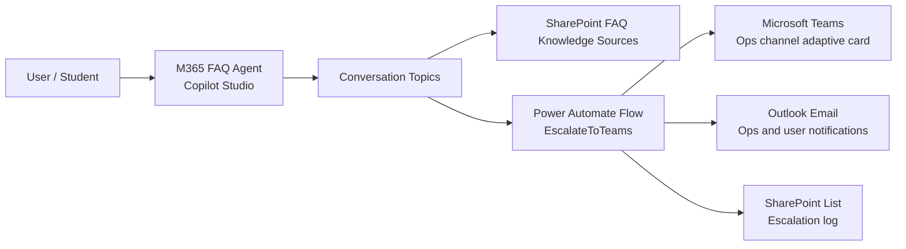
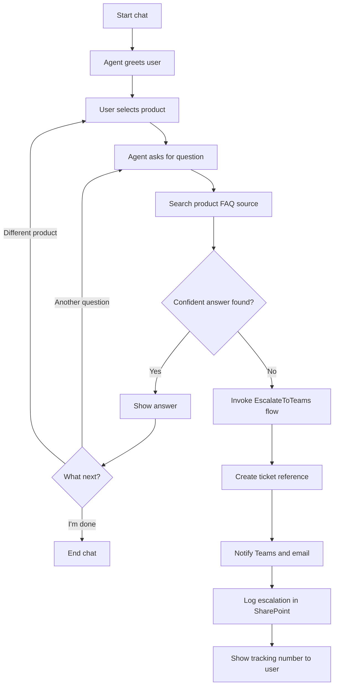
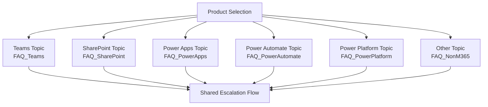

# M365 FAQ Agent - Solution Documentation and Presentation Content

## 1. Executive Summary

M365 FAQ Agent is a Microsoft Copilot Studio / Power Platform solution that helps users get quick answers to Microsoft 365 support questions. The agent guides the user to select a product, asks for the user's question, searches the related FAQ knowledge source, and provides an answer from the curated knowledge base.

If the agent cannot confidently answer, or if the user wants human help, the solution can escalate the question to an IT operations team through Power Automate. The escalation flow creates a tracking reference, posts an adaptive card to a Microsoft Teams channel, sends notification emails, and logs the escalation in SharePoint.

The solution is useful for students and beginners because it demonstrates a practical low-code support assistant using Copilot Studio, SharePoint knowledge sources, Microsoft Teams, Outlook, and Power Automate.

## 2. Solution Identity

| Item | Value |
|---|---|
| Solution name | M365FAQAgent |
| Version | 1.0.0.1 |
| Package type | Unmanaged Power Platform solution |
| Publisher | Vishnuprasad / Vishnu |
| Publisher email | info@wrvishnu.com |
| Publisher website | https://www.wrvishnu.com |
| Customization prefix | wr |
| Main agent | M365 FAQ Agent |
| Main workflow | EscalateToTeams |

## 3. Business Problem

Users often ask repeated questions about Microsoft 365 tools such as Teams, SharePoint, Power Apps, Power Automate, and Power Platform. Support teams spend time answering the same questions again and again.

This solution reduces that effort by:

- Giving users a self-service FAQ assistant.
- Searching curated SharePoint FAQ lists instead of open web content.
- Escalating unanswered questions to IT operations.
- Logging escalations so the team can identify knowledge gaps.
- Creating a clear ticket reference for follow-up.

## 4. Target Audience

Primary users:

- Students learning Microsoft 365 and Power Platform.
- Beginners learning how AI agents can connect to business systems.
- Employees who need quick answers about M365 products.
- IT helpdesk or operations teams that manage repeated FAQ questions.

Learning audience:

- People new to Copilot Studio.
- People new to Power Automate.
- People learning how SharePoint can act as a knowledge source.
- People learning how escalation and logging patterns work in business apps.

## 5. What the Solution Does

The M365 FAQ Agent performs the following functions:

1. Greets the user.
2. Shows product options:
   - Microsoft Teams
   - SharePoint
   - Power Apps
   - Power Automate
   - Power Platform
   - Other tools such as Zoom or VPN
3. Asks the user for a question.
4. Searches a matching FAQ knowledge source.
5. Returns a generated answer from trusted FAQ content.
6. Offers next actions, such as asking another question, choosing another product, escalating, or ending the chat.
7. Escalates unresolved questions to IT operations.
8. Sends Teams and email notifications.
9. Logs escalations in SharePoint.

## 6. High-Level Architecture



## 7. Main Components

### 7.1 Copilot Studio Agent

The main bot is named `M365 FAQ Agent`.

Important configuration:

- Generative actions are enabled.
- The agent uses a generative AI recognizer.
- Model knowledge is enabled.
- File analysis is enabled.
- Semantic search is enabled.
- Content moderation is set to low.
- Web browsing is disabled in the GPT component.

The agent instructions define the behavior:

- Answer questions about Microsoft Teams, SharePoint, Power Apps, Power Automate, Power Platform, and other tools.
- Search a curated FAQ knowledge base maintained by IT.
- Search only the selected product's knowledge source.
- Provide full FAQ answers when found.
- Do not guess.
- Escalate when no confident answer is found.

### 7.2 Topics

| Topic | Purpose |
|---|---|
| Conversation Start | Starts a new chat and asks the user to select a product. |
| Greeting | Handles greetings such as hi, hello, hey, good morning, and good afternoon. |
| Teams Questions | Handles Microsoft Teams questions. |
| Sharepoint Topic | Handles SharePoint questions. |
| Search / Conversational boosting | Creates generative answers from knowledge sources. |
| Escalate | System escalation topic for speaking to a representative. |
| Fallback | Handles unknown user messages. |
| Multiple Topics Matched | Asks the user to choose when multiple topics match. |
| Thank You | Responds when the user says thank you. |
| Goodbye | Responds when the user says goodbye. |
| Start Over | Lets the user restart the conversation. |
| End of Conversation | Collects feedback and ends the conversation. |
| Reset Conversation | Clears variables and cancels active dialogs. |
| Sign in | Handles sign-in requirements. |
| On Error | Handles runtime errors and logs telemetry. |

### 7.3 Knowledge Sources

The solution contains SharePoint-based knowledge source configurations for the following FAQ lists:

| Knowledge source | SharePoint location |
|---|---|
| FAQ_Teams | `https://vishtechtalk.sharepoint.com/sites/DemoSite/Lists/FAQ_Teams` |
| FAQ_SharePoint | `https://vishtechtalk.sharepoint.com/sites/DemoSite/Lists/FAQ_SharePoint` |
| FAQ_PowerApps | `https://vishtechtalk.sharepoint.com/sites/DemoSite/Lists/FAQ_PowerApps` |
| FAQ_PowerAutomate | `https://vishtechtalk.sharepoint.com/sites/DemoSite/Lists/FAQ_PowerAutomate` |
| FAQ_PowerPlatform | `https://vishtechtalk.sharepoint.com/sites/DemoSite/Lists/FAQ_PowerPlatform` |
| FAQ_NonM365 | `https://vishtechtalk.sharepoint.com/sites/DemoSite/Lists/FAQ_NonM365` |

These knowledge sources are configured as federated structured search sources backed by SharePoint list content.

### 7.4 Power Automate Flow

The escalation workflow is named `EscalateToTeams`.

Flow trigger inputs:

| Input | Meaning |
|---|---|
| `userQuestion` | The question asked by the user. |
| `userEmail` | The user's email address. |
| `product` | The selected product area, such as Teams. |
| `conversationId` | The Copilot conversation ID. |

Flow actions:

1. Initializes a ticket reference using the format `OPS-yyyyMMddHHmm`.
2. Posts an adaptive card to a Microsoft Teams channel.
3. Sends an email notification to the operations team.
4. Sends a confirmation email to the user.
5. Logs the escalation to a SharePoint list.
6. Returns the ticket reference to the agent.

Flow connectors:

| Connector | Usage |
|---|---|
| Microsoft Teams | Posts escalation card to an ops channel. |
| Office 365 Outlook | Sends notification and confirmation emails. |
| SharePoint Online | Logs escalation details to a SharePoint list. |

## 8. User Conversation Flow



## 9. Teams Question Flow

The Teams topic is the most complete product-specific flow in the current solution.

Steps:

1. Ask: "What's your question about Microsoft Teams?"
2. Save the user input in `Topic.VarUserQuestion`.
3. Search only the `FAQ_Teams` knowledge source.
4. If no answer is detected, invoke the `EscalateToTeams` flow.
5. If an answer is returned, ask the user what they want to do next.
6. Allow the user to:
   - Ask another Teams question.
   - Choose a different product.
   - Escalate to the IT team.
   - End the conversation.

Escalation message shown to the user:

```text
I couldn't find a confident answer to your question, so I've escalated it to our IT operations team.

Your tracking number is: {Topic.ticketRef}

You'll receive a confirmation email shortly. The IT ops team will respond within 2 business hours.

Thank you for using M365 FAQ Agent!
```

## 10. SharePoint Question Flow

The SharePoint topic asks the user for a SharePoint question and searches the `FAQ_SharePoint` knowledge source.

Steps:

1. Ask: "What's your question about SharePoint?"
2. Save the user input in `Topic.VarUserQuestion`.
3. Search only the `FAQ_SharePoint` knowledge source.
4. Ask the user what they want to do next.
5. Allow the user to:
   - Ask another SharePoint question.
   - Choose a different product.
   - End the conversation.

Current limitation: this SharePoint topic does not include the same explicit escalation branch that exists in the Teams topic.

## 11. Escalation Design

The escalation design is the main operational feature of the solution.

When escalation happens:

1. The bot passes the user's question, email, product, and conversation ID to Power Automate.
2. Power Automate creates a ticket reference.
3. The ops team receives a Teams adaptive card.
4. The ops team receives an email alert.
5. The user receives a confirmation email.
6. The escalation is stored in a SharePoint list for tracking and reporting.
7. The bot shows the tracking number back to the user.

### Adaptive Card

The Teams card includes:

- Ticket number.
- User email.
- Product.
- Original question.
- A "Claim and Respond" action.

### SharePoint Escalation Log

The flow writes these values to SharePoint:

| Field | Value |
|---|---|
| Title | User question |
| QueryDate | Current UTC date/time |
| Product | Selected product |
| ResolutionStatus | escalated |
| EscalationTicketRef | Generated ticket reference |
| UserId | User email |
| StaleContentFlagged | false |

## 12. Data and Knowledge Design

The solution separates knowledge by product. This is a good beginner-friendly design because each FAQ source has a clear purpose.

Recommended FAQ list fields:

| Field | Purpose |
|---|---|
| Title | Short FAQ question or topic title. |
| Answer | Full answer shown to users. |
| Product | Product category. |
| Keywords | Helpful search terms. |
| LastReviewedDate | Date the FAQ was checked. |
| Owner | Person/team responsible for the FAQ. |
| IsActive | Whether the FAQ should be used. |

Recommended content rules:

- Keep one FAQ per item.
- Use clear beginner-friendly language.
- Include step-by-step instructions.
- Add screenshots or links where useful.
- Review content regularly.
- Add new FAQ items when escalations repeat.

## 13. Security and Access Design

Security depends on Microsoft 365 and Power Platform permissions.

Key access requirements:

- Users need permission to use the agent.
- The agent needs access to the SharePoint FAQ sources.
- The escalation flow needs access to Microsoft Teams, Outlook, and SharePoint.
- The ops team needs access to the Teams escalation channel.
- SharePoint logs should be visible only to support/admin users.

Important security considerations:

- Do not store sensitive personal data unless required.
- Avoid exposing private SharePoint content through FAQ answers.
- Use least-privilege permissions for connectors.
- Replace hardcoded test email addresses before production use.
- Review Teams channel and SharePoint list permissions before sharing the agent widely.

## 14. Current Implementation Notes and Gaps

The package contains the foundation for a full multi-product FAQ agent. However, the exported topic routing shows a few current limitations:

| Area | Observation | Recommended improvement |
|---|---|---|
| Product routing from Conversation Start | Most product choices route to the Teams topic. | Route each product to its matching product topic. |
| SharePoint routing from Greeting | SharePoint correctly routes to the SharePoint topic in the Greeting topic. | Keep this pattern and apply it to Conversation Start. |
| Power Apps, Power Automate, Power Platform, Non-M365 | Knowledge sources exist, but separate conversational topics are not implemented in the export. | Create product-specific topics that search the matching source. |
| Escalation | Teams topic includes manual and automatic escalation. | Add the same escalation pattern to SharePoint and other product topics. |
| Email addresses | The flow uses a fixed email address in places. | Use the actual user email for user confirmation and a shared support mailbox for ops notification. |
| Ticket reference | Ticket reference uses minute-level timestamp. | Add seconds or a unique ID to reduce duplicate references. |
| Typo in variable/prompt | `VarProdtuctSelected` and "avilable" appear in the Greeting topic. | Rename variable and correct prompt text. |

## 15. Deployment Checklist

Before deploying to production:

- Import the unmanaged solution into the target Power Platform environment.
- Rebind all connection references.
- Confirm SharePoint FAQ lists exist in the target tenant.
- Confirm the escalation log SharePoint list exists.
- Update Teams group ID and channel ID.
- Replace test email addresses with production support/user email values.
- Test each product selection path.
- Test known FAQ questions.
- Test unknown questions and escalation.
- Confirm Teams card posting works.
- Confirm ops email and user email are sent correctly.
- Confirm SharePoint log item is created.
- Publish the agent.
- Share the agent with the correct audience.

## 16. Testing Scenarios

| Test | Expected result |
|---|---|
| Start a new conversation | Agent greets user and shows product choices. |
| Select Microsoft Teams and ask known FAQ | Agent answers from FAQ_Teams. |
| Ask another Teams question | Agent repeats Teams question flow. |
| Choose different product | Agent returns to product selection. |
| Ask unknown Teams question | Agent escalates and returns a ticket reference. |
| Select SharePoint from greeting | Agent asks SharePoint-specific question. |
| Say thank you | Agent responds politely. |
| Say goodbye | Agent asks whether to end the conversation. |
| Trigger fallback multiple times | Agent eventually routes to escalation. |
| Flow failure | Error topic should handle runtime failure. |

## 17. Maintenance Guide

Routine maintenance:

- Review unresolved escalation logs weekly.
- Add new FAQ items for repeated questions.
- Update stale FAQ content.
- Monitor failed flow runs.
- Check connection reference health after password or permission changes.
- Review Teams channel activity.
- Check whether users are receiving useful answers.

Suggested metrics:

- Number of questions asked.
- Number of questions answered without escalation.
- Number of escalations.
- Top repeated question categories.
- Average response time for escalations.
- FAQ items added from escalations.

## 18. Beginner-Friendly Explanation

Think of the solution as a smart helpdesk chatbot.

The SharePoint FAQ lists are the books it reads. Copilot Studio is the chatbot brain and conversation interface. Power Automate is the helper that does work outside the chat, such as sending messages, sending emails, and saving records. Microsoft Teams is where the IT team sees escalated questions.

When the chatbot knows the answer, it replies immediately. When it does not know the answer, it asks a human support team for help and gives the user a tracking number.

## 19. Presentation Slides Content

### Slide 1 - Title

**M365 FAQ Agent**

An AI-powered FAQ and escalation assistant for Microsoft 365 support.

Presented for students and beginners.

Speaker notes:

Today we will look at a practical Microsoft 365 support chatbot built with Copilot Studio, SharePoint, Power Automate, Teams, and Outlook.

### Slide 2 - Problem

**The support challenge**

- Users ask repeated Microsoft 365 questions.
- IT teams answer the same questions many times.
- Beginners may not know where to find official help.
- Some questions need human support.

Speaker notes:

The problem is simple: many support questions are repeated. A chatbot can answer common questions quickly and send difficult questions to the right team.

### Slide 3 - Solution Overview

**What the M365 FAQ Agent does**

- Greets the user.
- Lets the user choose a product.
- Searches a product-specific FAQ source.
- Answers from curated SharePoint content.
- Escalates unanswered questions to IT operations.
- Sends notifications and logs the request.

Speaker notes:

The agent is not just a chatbot. It is connected to business systems, so it can search knowledge and create escalation records.

### Slide 4 - Audience

**Who this helps**

- Students learning Microsoft 365.
- Beginners learning Power Platform.
- Employees who need quick help.
- IT teams handling repeated questions.

Speaker notes:

This is a good learning project because it uses real Microsoft 365 services in a simple support scenario.

### Slide 5 - Products Covered

**FAQ categories**

- Microsoft Teams
- SharePoint
- Power Apps
- Power Automate
- Power Platform
- Other non-M365 tools

Speaker notes:

The solution separates knowledge by product. This makes the FAQ easier to maintain and makes answers more focused.

### Slide 6 - How the Chat Works

**Basic conversation flow**

1. User starts chat.
2. Agent asks for product.
3. User selects product.
4. Agent asks for question.
5. Agent searches FAQ.
6. Agent answers or escalates.

Speaker notes:

This flow is beginner-friendly because the user does not need to know where information is stored. The agent guides them step by step.

### Slide 7 - Solution Architecture

**Main building blocks**

- Copilot Studio agent for chat.
- SharePoint lists for FAQ knowledge.
- Power Automate for escalation.
- Microsoft Teams for ops notification.
- Outlook for email confirmation.
- SharePoint list for escalation logging.

Speaker notes:

Each Microsoft service has a clear job. Copilot Studio talks to the user, SharePoint stores knowledge, and Power Automate connects the process together.

### Slide 8 - Knowledge Source Design

**Why SharePoint is used**

- Easy for teams to maintain FAQ content.
- Supports product-specific lists.
- Keeps answers inside the organization.
- Can be reviewed and updated by IT owners.

Speaker notes:

Instead of asking the agent to guess, the solution uses curated SharePoint FAQ lists. This makes the answers more controlled and reliable.

### Slide 9 - Escalation Flow

**When the bot cannot answer**

- Creates a ticket reference.
- Posts an adaptive card to Teams.
- Sends an email to the operations team.
- Sends a confirmation email to the user.
- Saves the escalation in SharePoint.

Speaker notes:

Escalation is important because the user should not get stuck. If the agent cannot answer, the support team is notified.

### Slide 10 - Example User Journey

**Example**

- User selects Microsoft Teams.
- User asks: "How do I add a guest to a team?"
- Agent searches the Teams FAQ list.
- If answer exists, it replies with steps.
- If no confident answer exists, it creates an escalation ticket.

Speaker notes:

This example shows the difference between self-service and assisted support. The same chatbot can handle both.

### Slide 11 - Benefits

**Why this solution is useful**

- Faster answers for users.
- Less repeated work for IT.
- Clear escalation path.
- FAQ gaps become visible.
- Easy to extend with more topics.

Speaker notes:

The biggest benefit is that support becomes more organized. Easy questions are answered automatically and difficult questions are tracked.

### Slide 12 - What Beginners Can Learn

**Learning outcomes**

- How a Copilot Studio agent is structured.
- How topics control conversation flow.
- How SharePoint can be a knowledge source.
- How Power Automate connects services.
- How Teams and email can support escalation.

Speaker notes:

This project is a strong beginner example because it shows an end-to-end business process without requiring custom code.

### Slide 13 - Current Limitations

**Possible next steps**

- Add analytics dashboard for FAQ usage.
- Add approval process for new FAQ content.
- Add multilingual answers.
- Add user satisfaction reporting.
- Add adaptive card actions for support staff response.

Speaker notes:

Once the basic agent works, the next step is improving operations: reporting, content governance, and better support workflows.

### Slide 15 - Demo

1. Open the M365 FAQ Agent.
2. Show the product selection menu.
3. Select Microsoft Teams.
4. Ask a known Teams FAQ question.
5. Show the answer from the knowledge source.
6. Choose "Escalate to IT team".
7. Show the tracking number response.
8. Show the Teams adaptive card.
9. Show the email notification.
10. Show the SharePoint escalation log item.


### Slide 16 - Summary

**Key takeaway**

M365 FAQ Agent shows how Microsoft 365 and Power Platform can be combined to create a practical AI support assistant.

It helps users get answers faster, helps IT teams reduce repeated work, and gives beginners a clear example of a real-world low-code solution.

Speaker notes:

The solution is valuable because it is simple to understand but covers real business needs: knowledge search, automation, escalation, and tracking.


## 21. Recommended Final Design

The target design should use one topic per product:



This design keeps the user experience consistent and makes maintenance easier.

## 22. Conclusion

M365 FAQ Agent is a practical support automation solution. It combines AI-based conversation, SharePoint FAQ search, and Power Automate escalation. For students and beginners, it is a useful example of how low-code tools can solve a real workplace problem.

The current solution already demonstrates the core pattern. With improved product routing, product-specific topics, and consistent escalation across all categories, it can become a complete Microsoft 365 FAQ support assistant.
